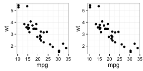
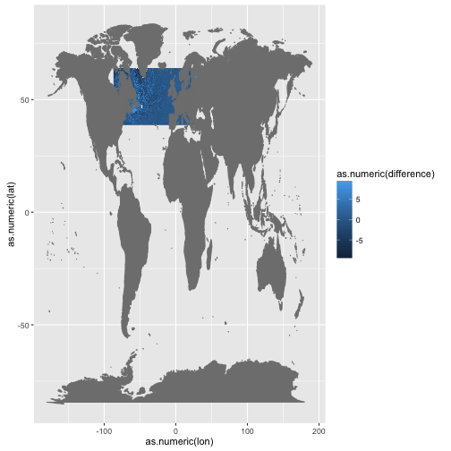

"Part_A_map_difference"
===

Etienne Low-Décarie  
2016-10-31


Housekeeping
===

Clear memory

```r
rm(list=ls())
```

Housekeeping
===

Load required packages

```r
require(dplyr)
require(ggplot2)
require(tidyr)
require(scales)
require(RNetCDF)
require(gridExtra)
```

install missing packages using  :

```r
install.packages("package_name")
```

Set the theme for the plots
===

Example plot

```r
p_original <- ggplot(mtcars, aes(mpg, wt)) +
  geom_point()
```
Change theme

```r
p_bw_theme <- p_original+theme_bw()
```
Set theme for all other plots

```r
theme_set(theme_bw())
```


```r
grid.arrange(p_original,p_bw_theme, nrow=1)
```


see http://docs.ggplot2.org/dev/vignettes/themes.html for other options


Function to load giovani files 
===

part 1
Open the function and load the data


```r
read_giovanni_nc_map <- function(giovanni_nc_map_file){
  #Load the NetCDF file
  giovanni_map_data <- open.nc(giovanni_nc_map_file)
  
  #Extract its content
  giovanni_map_data <- read.nc(giovanni_map_data)
```

Function to load giovani files 
===
part 2
Convert its content to a data frame

```r
  giovanni_map_dataframe <- as.data.frame(giovanni_map_data[1])
  names(giovanni_map_dataframe) <- giovanni_map_data[[2]]
  giovanni_map_dataframe$lon <- giovanni_map_data[[3]]
```

Function to load giovani files 
===
part 3

Switch from a wide matrix format in which values for longitude are given across columns to a long format, with a single temperature measurement per row

Close the function
 

```r
  giovanni_map_data <- gather(giovanni_map_dataframe,
                              "lat","temperature",
                              -length(names(giovanni_map_dataframe)))
  
  return(giovanni_map_data)
}
```

Climatic averaged data
===

Apply the function to climatic averaged data.  

Change the file name in the script to match the file name downloaded from Giovanni.  This will ensure that the metadata held in the filename are kept.


```r
climatic_average <- read_giovanni_nc_map("./Data/climatic_average_sea.nc")
climatic_average <- rename(climatic_average,
                           climatic_temperature=temperature)
```

Single year/month data
===

Apply the function to single year/month data.  

Again, change file name as needed.

```r
single_year <- read_giovanni_nc_map("./Data/single_year_sea.nc")
single_year <- rename(single_year,
                      year_temperature=temperature)
```

Merge the data 
===

```r
anomaly <- single_year
anomaly$climatic_temperature <- climatic_average$climatic_temperature
```

Calculate the anomalies
===

```r
anomaly$difference <- with(anomaly, year_temperature-climatic_temperature)
```

Remove missing values
===


```r
anomaly <- na.omit(anomaly)
```


Constrain the data to sensible values
===

```r
anomaly <- anomaly[anomaly$difference<10 & anomaly$difference>-10,]
```

Plot the anomaly on a map #
===

```r
p <- ggplot()+
  geom_raster(data=anomaly,aes(
           x=as.numeric(lon),
           y=as.numeric(lat),
           fill=as.numeric(difference)))+
    borders("world",
            colour="gray50",
            fill="gray50")
```

Show unedited map
===

```r
print(p)
```



Edit plot details
===

```r
p <- p+
  scale_x_continuous("Axis title", limits=c(-87.0117,27.5977))+
  scale_y_continuous("Axis title", limits=c(38.6719,63.9844))+
  scale_fill_gradientn("Title of legend",
                       colours=c("blue","white","red"))+
  coord_equal()+
  theme(axis.ticks=element_line(colour="red"),
        axis.text=element_text(colour="green"))
```


Show edited map
===

```r
print(p)
```


Save the plot to a PDF file 
===
Change file name

```r
pdf("./Plots/file.pdf",width=7,height=7)
print(p)
graphics.off()
```
